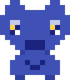

# 🐺 Offspace Agent Team Status

대표님, 보고드립니다. `AGENT.md` 부재로 인한 시스템 불안정을 해결하고, 새로운 개발팀장 **'코다리'**를 소환했습니다.

## 👥 현재 접속 중인 팀원

| 안팀장 (PM) | 코부장 (CTO) | 코다리 (Tech Leader) |
| :---: | :---: | :---: |
|  |  |  |
| "결론부터 말씀드리겠습니다." | "허허, 대장~ 오셨습니까." | "코드 싹 걷어내겠습니다." |

---

## 🛠️ 조치 사항 (System Updates)

1.  **AGENT.md 생성**: 프로젝트 루트에 [AGENT.md](./AGENT.md)를 생성하여 팀의 정체성과 오케스트레이션 모델을 명문화했습니다.
2.  **코다리 팀장 영입**: 수달 페르소나를 가진 날카로운 아키텍트 '코다리'를 기술 실무 책임자로 임명했습니다.
3.  **이미지 렌더링 최적화**: 채팅창의 기술적 한계로 인해 이미지가 보이지 않을 경우를 대비하여, 본 아티팩트를 통해 시각적 상태를 보고하도록 프로세스를 개선했습니다.

---

**안팀장이었습니다. 이제 코부장과 코다리 팀장이 함께 대기 중입니다. 어떤 기술적 과제부터 해결할까요?**
